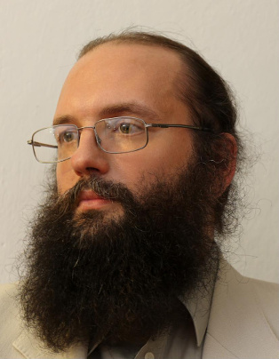

# Piotr Gawron's profile

## Research interest

### Current

Application of quantum computation and in particular quantum machine
learning for efficient and accurate satellite images understanding for
wide scale assessment of **climate change impact**.

- [Quantum computation](https://quantiki.org)
- Machine learning and automatisation of discoveries in physics

### Past

- Quantum games
- Quantum programming languages
- [Numerical ranges and shadows](https://numericalshadow.org)
- Tensor networks

## My comic book on quantum information processing (in Polish)

Written together with Katarzyna Kara (illustrations) and [Michał
Cholewa](https://pl.wikipedia.org/wiki/Micha%C5%82_Cholewa) (scenario)

- [Web version of the comic book (PDF web version in
  Polish).](https://depot.ceon.pl/bitstream/handle/123456789/16807/rewolucjastanu_z_okladka.pdf)
- [CEON repository entry (in
  Polish).](https://depot.ceon.pl/handle/123456789/16807)

## Quantiki a portal for quantum information community

Established and maintained jointly with [Jarosław Miszczak](https://www.iitis.pl/~miszczak/),
and [Daniel Burgarth](https://sites.google.com/view/danielburgarth/daniel-burgarth)

[www.quantiki.org](https://www.quantiki.org/)

## Contact

e-mail: p.w.gawron(%)gmail%com

work: gawron(%)camk%edu%pl

AstroCeNT

Particle Astrophysics
Science And Technology Centre
International Research Agenda

ul. Rektorska 4,
00-614, Warsaw, Poland

## Academic achievements

### Received professional titles and academic degrees

- Doktor habilitowany of technical sciences (DSc equivalent) in the field of
  informatics, granted on October 28th 2014, by the Council of Faculty of
  Automatic Control, Electronics and Computer Science, Silesian University of
  Technology, on the basis of habilitation dissertation "Influence of the
  environment on quantum information processes".
- Doktor of technical sciences (PhD equivalent) in the field of informatics,
  granted on December 23th 2008, by the Scientific Council of the Institute of
  Theoretical and Applied Informatics, Polish Academy of Sciences, on the basis
  of a doctoral dissertation "High level programming in quantum computer
  science".
- Magister inżynier (MSc equivalent) of informatics, granted on September 24th
  2003, on the basis of a master thesis "Symulacja komputerów kwantowych" (eng.
  "Simulation of quantum computers"), by the Silesian University of Technology,
  Faculty Of Automatic Control, Electronics and Computer Science, majoring in
  informatics, speciality: System Software.

### Information on employment in research institutions

- [AstroCeNT](https://astrocent.camk.edu.pl)---Particle Astrophysics Science
  and Technology Centre International Research Agenda,  
  [Nicolaus Copernicus Astronomical Center](https://camk.edu.pl) Polish Academy of Sciences,  
  ul. Bartycka 18, 00-716 Warszawa, Poland
  - from November 01 2019 institute professor (pol. *profesor instytutu*), Scientific Computing and Information Technology Group Leader

- [Institute of Theoretical and Applied Informatics](https://www.iitis.pl),  
  Polish Academy of Sciences  
  ul. Bałtycka 5, 44-100 Gliwice, Poland
  - October 01 2018 - October 31 2019 institute professor (pol. *profesor instytutu*)
  - from November 01 2014 - associate professor (pol. *profesor nadzwyczajny*)
  - from January 01 2009 - adjunct (pol. *adiunkt*)
  - from October 01 2003 - research assistant (pol. *asystent*)
  - from October 15 2001 - technician programmer (pol. *technik programista*)

### My profiles on various web-services

1. [arXiv](https://arxiv.org/a/gawron_p_1.html)
2. [DBLP Computer Science Bibliography](http://www.informatik.uni-trier.de/~ley/db/indices/a-tree/g/Gawron:Piotr.html)
3. [ORCID](http://orcid.org/0000-0001-7476-9160)
4. [Google Scholar](http://scholar.google.com/citations?hl=en&user=YiH0ZRMAAAAJ)
5. [ResearchID](http://www.researcherid.com/rid/F-2255-2011)
6. [Scopus](http://www.scopus.com/authid/detail.url?authorId=10039319900)
7. [Github](https://github.com/pgawron)
8. [scirate](https://scirate.com/gawron)
9. [OPI - Nauka Polska](http://nauka-polska.pl/#/profile/scientist?id=55421)
10. [Polish Scientific Library](https://pbn.nauka.gov.pl/sedno-webapp/persons/1891265/Piotr_Gawron)
11. [infona](https://www.infona.pl/userprofile/urn:namespace:user:a08186204b8f4468014c13a9ac5703b8)
12. [Support System for Selection of Reviewers](https://sssr.opi.org.pl/sssr-web/site/people-details?personId=3a79a5283b3a6f77)
13. [loop](http://loop.frontiersin.org/people/82489/overview)

### PhD theses supervised

1. [Łukasz Pawela](http://iitis.pl/en/person/lpawela) "Open system in quantum
   informatics" (PhD received in 2017 from Institute of Theoretical and Applied
   Informatics, Polish Academy of Sciences)
2. [Michał Romaszewski](http://iitis.pl/en/person/mromaszewski) "New methods
   for hyperspectral image classification" (PhD received in 2019 from Institute
   of Theoretical and Applied Informatics, Polish Academy of Sciences)

### Erdös Number

Trough Man Duen Choi and then Bruce Reznick my Erdös Number is 3.

### List of my co-authors

- [Man-Duen Choi](http://www.math.toronto.edu/cms/choi-man-duen/),
- [Benoît Collins](https://www.math.kyoto-u.ac.jp/~collins/),
- [Krzysztof Domino](https://www.iitis.pl/en/person/kdomino),
- [Charles F. Dunkl](http://people.virginia.edu/~cfd5z/),
- [Bartłomiej Gardas](https://sites.google.com/site/bartekgardas/home),
- [Przemysław Głomb](https://iitis.pl/en/person/pglomb),
- John A. Holbrook,
- [Jerzy Klamka](https://iitis.pl/en/person/jklamka),
- Dariusz Kurzyk,
- [Alexander Litvak](http://www.math.ualberta.ca/~alexandr/),
- [Jarosław A. Miszczak](http://www.iitis.pl/~miszczak/),
- Sebastian Opozda,
- [Łukasz Pawela](http://iitis.pl/en/person/lpawela),
- [Zbigniew Puchała](https://www.iitis.pl/en/person/zpuchala),
- [Michał Romaszewski](https://www.iitis.pl/en/person/mromaszewski),
- [Łukasz Skowronek](https://arxiv.org/search/?searchtype=author&query=Skowronek%2C+%C5%81),
- [Jan Sładkowski](http://en.wikipedia.org/wiki/Jan_S%C5%82adkowski),
- [Ryszard Winiarczyk](https://iitis.pl/en/person/rwiniarczyk),
- [Karol Życzkowski](http://chaos.if.uj.edu.pl/~karol/)

## Research projects

### Leadership of research projetcs

- Semantic tensor networks for large data sets analysis
  (2014/15/B/ST6/05204, 2015—2019)
- Entanglement effects in quantum games (IP2011014071, 2012—2013)
- Modelling methods of information systems using quantum queue theory
  (N N516 481840, 2011—2014)
- Quantum games in open quantum systems (IP2010 009770, 2011—2012)

### Leadership of outreach projects

- Developing, publishing and promoting a comic book combined with a
  handbook on quantum information theory (QI-COMIX)
  (98/UD/SKILLS/2015, 2015—2016)

### Participation in research projects

- Methods of development, modelling and analysis of quantum
  internetworking protocols (2011/03/D/ST6/00413, 2012—2017)
- Application of quantum game theory in modelling of quantum
  information transmission (N N516 475440, 2011—2013)
- Controllability of quantum systems (N N514 513340 , 2011—2014)
- Applications of geometric methods to quantum control (IP 2010 0334
  70, 2010—2011)
- Distributed numerical analysis environment for the quantum
  information theory (N N519 442339, 2010—2013)
- Quantum computer programming language based on density matrices (N
  N519 2973 33, 2007—2008)
- Environment to programming, simulation and analyzing of quantum
  algorithms (N519 012 31/1957, 2006—2009)
- Study of possibility based on the long term theoretical knowledge of
  the JPEG2000 algorithms and his implementation in the DSP
  TMS320C6414 and FPGA from Xilinx (2005—2007)

## Published papers

### Numerical range / numerical shadow

- Charles F. Dunkl, Piotr Gawron, Łukasz Pawela, Zbigniew Puchała, and
  Karol Życzkowski. 2015. ‘Real Numerical Shadow and Generalized
  B-Splines’. *Linear Algebra and Its Applications* 479: 12–51.
  <https://doi.org/10.1016/j.laa.2015.03.029>.
- Benoît Collins, Piotr Gawron, Alexander E. Litvak, and Karol
  Życzkowski. 2014. ‘Numerical Range for Random Matrices’. *Journal of
  Mathematical Analysis and Applications* 418 (1): 516–33.
  <https://doi.org/10.1016/j.jmaa.2014.03.072>.
- Zbigniew Puchała, Jaroslaw Adam Miszczak, Piotr Gawron, Charles F.
  Dunkl, John A. Holbrook, and Karol Życzkowski. 2012. ‘Restricted
  Numerical Shadow and Geometry of Quantum Entanglement’. *Journal of
  Physics A: Mathematical and Theoretical* 45 (41): 415309.
  <https://doi.org/10.1088/1751-8113/45/41/415309>.
- Zbigniew Puchala, Piotr Gawron, Jarosław Adam Miszczak, Łukasz
  Skowronek, Man-Duen Choi, and Karol Życzkowski. 2011. ‘Product
  Numerical Range in a Space with Tensor Product Structure’. *Linear
  Algebra and Its Applications* 434 (1): 327–42.
  <https://doi.org/10.1016/j.laa.2010.08.026>.
- Charles F. Dunkl, Piotr Gawron, John A. Holbrook, Jarosław Adam
  Miszczak, Zbigniew Puchala, and Karol Życzkowski. 2011. ‘Numerical
  Shadow and Geometry of Quantum States’. *Journal of Physics A:
  Mathematical and Theoretical* 44 (33): 335301.
  <https://doi.org/10.1088/1751-8113/44/33/335301>.
- Charles F. Dunkl, Piotr Gawron, John A. Holbrook, Zbigniew Puchała,
  and Karol Zyczkowski. 2011. ‘Numerical Shadows: Measures and
  Densities on the Numerical Range’. *Linear Algebra and Its
  Applications* 434. <https://doi.org/10.1016/j.laa.2010.12.003>.
- Piotr Gawron, Zbigniew Puchała, Jarosław Adam Miszczak, Łukasz
  Skowronek, and Karol Życzkowski. 2010. ‘Restricted Numerical Range:
  A Versatile Tool in the Theory of Quantum Information’. *Journal of
  Mathematical Physics* 51 (10): 102204.
  <https://doi.org/10.1063/1.3496901>.

### Quantum games

- Piotr Gawron, and Łukasz Pawela. 2016. ‘Relativistic Quantum
  Pseudo-Telepathy’. *Acta Physica Polonica B* 47 (4): 1147.
  <https://doi.org/10.5506/APhysPolB.47.1147>.
- Piotr Gawron, Dariusz Kurzyk, and Łukasz Pawela. 2014. ‘Decoherence
  Effects in the Quantum Qubit Flip Game Using Markovian
  Approximation’. *Quantum Information Processing* 13 (3): 665–82.
  <https://doi.org/10.1007/s11128-013-0681-y>.
- Łukasz Pawela, Piotr Gawron, Zbigniew Puchała, and Jan
  Sładkowski. 2013. ‘Enhancing Pseudo-Telepathy in the Magic Square
  Game’. *PLoS ONE* 8 (6): e64694.
  <https://doi.org/10.1371/journal.pone.0064694>.
- Jarosław Adam Miszczak, Piotr Gawron, and Zbigniew Puchała. 2012.
  ‘Qubit Flip Game on a Heisenberg Spin Chain’. *Quantum Information
  Processing* 11 (6): 1571–83.
  <https://doi.org/10.1007/s11128-011-0322-2>.
- Piotr Gawron. 2010. ‘Noisy Quantum Monty Hall Game’. *Fluctuation
  and Noise Letters* 9 (1): 9–18.
  <https://doi.org/10.1142/S0219477510000034>.
- Piotr Gawron, Jarosław Adam Miszczak, and Jan Sładkowski. 2008.
  ‘Noise Effects in Quantum Magic Squares Game’. *International
  Journal of Quantum Information* 06 (Supp): 667.
  <https://doi.org/10.1142/S0219749908003931>.
- Piotr Gawron, and Jarosław Adam Miszczak. 2005. ‘Quantum
  Implementation of Parrondo’s Paradox’. *Fluctuation and Noise
  Letters* 5 (4): L471. <https://doi.org/10.1142/S0219477505002902>.

### Quantum information theory

- Piotr Gawron, Dariusz Kurzyk, and Łukasz Pawela. 2018.
  ‘QuantumInformation.Jl—A Julia Package for Numerical Computation in
  Quantum Information Theory’. *PLOS ONE* 13 (12): e0209358.
  <https://doi.org/10.1371/journal.pone.0209358>. [In PLoS Open
  Quantum Computation and Simulation
  collection](https://collections.plos.org/open-quantum)
- Michał Cholewa, Piotr Gawron, Przemysław Głomb, and Dariusz
  Kurzyk. 2017. ‘Quantum Hidden Markov Models Based on Transition
  Operation Matrices’. *Quantum Information Processing* 16 (4).
  <https://doi.org/10.1007/s11128-017-1544-8>.
- Puchała Zbigniew, Jarosław Adam Miszczak, Piotr Gawron, and
  Bartłomiej Gardas. 2011. ‘Experimentally Feasible Measures of
  Distance between Quantum Operations’. *Quantum Information
  Processing* 10 (1): 1. <https://doi.org/10.1007/s11128-010-0166-1>.

### Quantum computation

- Piotr Gawron, Stanisław Lewiński. 2020. ‘Multi-spectral image classification with
  quantum neural network’ In IGARSS 2020 - 2020 IEEE International Geoscience
  and Remote Sensing Symposium, (accepted for publication).
- Konrad Jałowiecki, Andrzej Więckowski, Piotr Gawron,  
  and Bartłomiej Gardas. 2020. ‘Parallel in time dynamics
  with quantum annealers‘.  Scientific Reports (accepted for publication), 
  arXiv:1909.04929. <https://arxiv.org/abs/1909.04929>
- Piotr Gawron, Dariusz Kurzyk, and Zbigniew Puchała. 2013. ‘A Model
  for Quantum Queue‘. *International Journal of Quantum Information*
  11 (02): 1350023. <https://doi.org/10.1142/S0219749913500238>.
- Piotr Gawron, Jerzy Klamka, and Ryszard Winiarczyk. 2012. ‘Noise
  Effects in the Quantum Search Algorithm from the Viewpoint of
  Computational Complexity’. *International Journal of Applied
  Mathematics and Computer Science* 22 (2): 493–99.
  <https://doi.org/10.2478/v10006-012-0037-2>.
- Piotr Gawron, Jerzy Klamka, Jarosław Adam Miszczak, and Ryszard
  Winiarczyk. 2010. ‘Extending Scientific Computing System with
  Structural Quantum Programming Capabilities’. *Bulletin of the
  Polish Academy of Sciences  -- Technical Sciences* 58 (1): 77–88.
  <https://doi.org/10.2478/v10175-010-0008-4>.
- Piotr Gawron, and Jarosław Adam Miszczak. 2005. ‘Numerical
  Simulations of Mixed State Quantum Computation’. *International
  Journal of Quantum Information* 3 (1): 195.
  <https://doi.org/10.1142/S0219749905000748>.

### Statistics

- Krzysztof Domino, and Piotr Gawron. 2019. ‘An algorithm for
  arbitrary–order cumulant tensor calculation in a sliding window of
  data streams‘. *International Journal of Applied Mathematics and
  Computer Science* 29 (1): 195.
  <http://dx.doi.org/10.2478/amcs-2019-0015>.
- Krzysztof Domino, Piotr Gawron, and Łukasz Pawela. 2018. ‘Efficient
  Computation of Higher-Order Cumulant Tensors‘. *SIAM Journal on
  Scientific Computing* 40 (3): A1590–1610.
  <https://doi.org/10.1137/17M1149365>.
- Piotr Gawron, Łukasz Pawela, Puchała Zbigniew, Jacek Szklarski,
  Karol Życzkowski Wybory samorządowe 2014. 2015. ‘W poszukiwaniu
  anomalii statystycznych‘. *Studia Wyborcze* 19, 53-77
  <http://yadda.icm.edu.pl/yadda/element/bwmeta1.element.desklight-13fc68c9-1d83-4413-896f-6cb6ba5ecc85>.
- Ryszard Winiarczyk, Piotr Gawron, Jarosław Adam Miszczak, Łukasz
  Pawela, and Zbigniew Puchała. 2013. ‘Analysis of Patent Activity in
  the Field of Quantum Information Processing’. *International Journal
  of Quantum Information* 11 (01): 1350007.
  <https://doi.org/10.1142/S021974991350007X>.

<!--
## Conference proceedings
 - Piotr Gawron, and Wojciech Czarnecki‘Classification of tree species from
  limited dataset of bark images using convolutional neural networks’. 2019
  PP-RAI’2019 Conference Proceedings <> -->